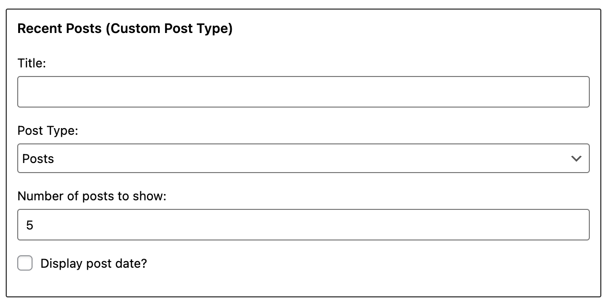
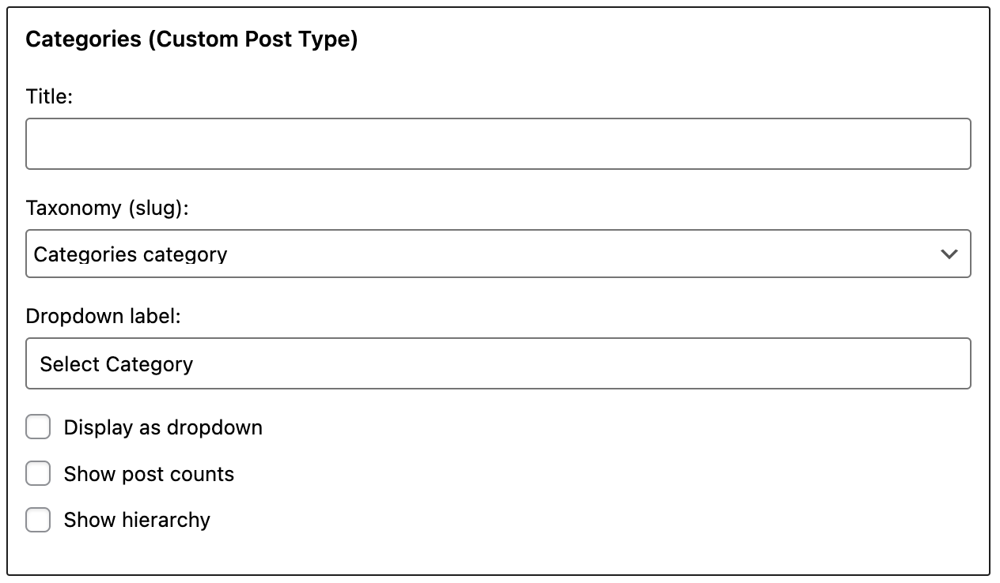
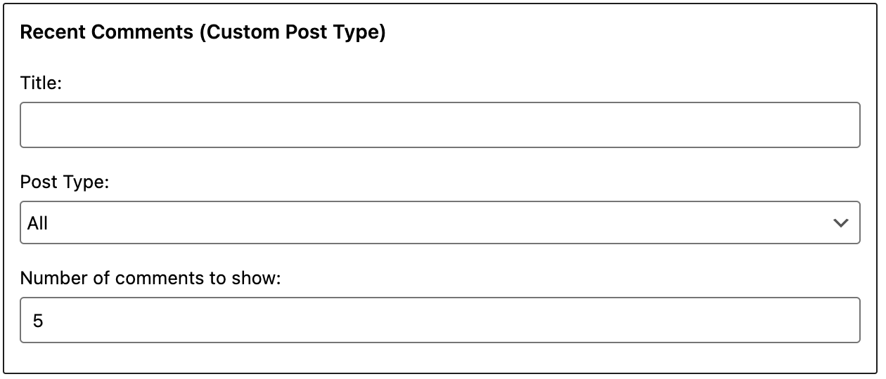

# Introducing Custom Post Type Widgets

[](https://travis-ci.org/thingsym/custom-post-type-widgets)

[](https://wordpress.org/plugins/custom-post-type-widgets/)

This WordPress plugin adds default custom post type widgets. You can filter by registered Custom Post Type or Taxonomy on widgets.

## How do I use it?

1. Download and unzip files. Or install Custom Post Type Widgets plugin using the WordPress plugin installer. In that case, skip 2.
2. Upload "custom-post-type-widgets" to the "/wp-content/plugins/" directory.
3. Activate the plugin through the 'Plugins' menu in WordPress.
4. Adds widgets to a widget area and configure settings through the 'Widgets' menu in WordPress.
5. Have fun!

**IMPORTANT**: By default, WordPress will not work Date-based permalinks of custom post type. Recommend that you install the plugin in order to edit the permalink, if you are using a Date-based permalinks.

And try the following: [Custom Post Type Rewrite](https://wordpress.org/plugins/custom-post-type-rewrite/)

## Descriptions of Widgets

### Recent Posts (Custom Post Type)



display a list of the most recent custom posts.

* **Title** - description that appears over the list of recent custom posts.
* **Post Type** - if selected, filter by a custom post type. (e.g. post).
* **Number of posts to show (at most 15)** - enter the number of posts to display.
* **Display post date?** - if checked, display post date.
* **Class Name** - widget_recent_entries

### Archives (Custom Post Type)


display a list of archive links for each month that has custom posts.

* **Title** - description that appears over the list of archive links.
* **Post Type** - if selected, filter by a custom post type. (e.g. post).
* **Display as dropdown** - if checked, this box causes the archives to be displayed in a drop-down box.
* **Show post counts** - if checked, this box causes a count of the number of posts for each archive period.
* **Class Name** - widget_archive

### Categories (Custom Post Type)



display a list of categories that has custom posts.

* **Title** - description that appears over the list of categories.
* **Taxonomy** - if selected, filter a custom taxonomy (e.g. category).
* **Display as dropdown** - if checked, this box causes the categories to be displayed in a dropdown box.
* **Show post counts** - if checked, this box causes the count of the number of posts to display with each category.
* **Show hierarchy** - if checked, shows parent/child relationships in an indented manner.
* **Class Name** - widget_categories

### Calendar (Custom Post Type)


display a calendar of the current month.

* **Title** - description that appears over the calendar.
* **Post Type** - if selected, filter by a custom post type. (e.g. post).
* **Class Name** - widget_calendar

### Recent Comments (Custom Post Type)



display a list of the most recent comments.

* **Title** - description that appears over the list of recent comments.
* **Post Type** - if selected, filter by a custom post type. (e.g. post).
* **Number of comments to show (at most 15)** - enter the number of comments to be displayed.
* **Class Name** - widget_recent_comments

### Tag Cloud (Custom Post Type)


display a list of the top 45 that has used in a tag cloud.

* **Title** - description that appears over the tag cloud.
* **Taxonomy** - if selected, filter a custom taxonomy (e.g. post_tag).
* **Show tag counts** - if checked, this box causes the count of the number of tags to display with each tag.
* **Class Name** - widget_tag_cloud

### Search (Custom Post Type)


A search form for your site.

* **Title** - description that appears over the search.
* **Post Type** - if selected, filter by a custom post type. (e.g. post).
* **Class Name** - widget_search

## Hooks

Custom Post Type Widgets has its own hooks.

### Filter hooks

* custom_post_type_widgets/archive/widget_archives_dropdown_args
* custom_post_type_widgets/archive/widget_archives_args
* custom_post_type_widgets/categories/widget_categories_dropdown_args
* custom_post_type_widgets/categories/widget_categories_args
* custom_post_type_widgets/recent_comments/widget_comments_args
* custom_post_type_widgets/recent_posts/widget_posts_args
* custom_post_type_widgets/search/filter_post_type
* custom_post_type_widgets/tag_cloud/widget_tag_cloud_args
* custom_post_type_widgets/calendar/get_custom_post_type_calendar

### Action hooks

* custom_post_type_widgets/recent_posts/widget/before
* custom_post_type_widgets/recent_posts/widget/prepend
* custom_post_type_widgets/recent_posts/widget/append
* custom_post_type_widgets/recent_posts/widget/after

## Frequently Asked Questions

### 404 error when clicking month link.

You may need to edit the permalink of custom post type.

By default, WordPress will not work Date-based permalinks of custom post type.

For example, a month link generates a link in a format like `/<custom post type name>/date/YYYY/MM/`, if you set `Numeric` in Common Settings in Permalink Settings.

The month link has the following two patterns depending on the Common Settings.
But a link like below will not work.

* `/<custom post type name>/YYYY/MM/` (Day and name, Month and name, Post name)
* `/<custom post type name>/date/YYYY/MM/` (Numeric)

Recommend that you install the plugin in order to edit the permalink, if you are using a Date-based permalinks by the Widget.

And try the following:

Custom Post Type Rewrite
[https://wordpress.org/plugins/custom-post-type-rewrite/](https://wordpress.org/plugins/custom-post-type-rewrite/)

### Taxonomy select of Categories or Tags do not appear.

Check the setting of the **hierarchical** argument of the register_taxonomy function.

> hierarchical  
> (boolean) (optional) Is this taxonomy hierarchical (have descendants) like categories or not hierarchical like tags.  
> Default: false

Reference: [https://codex.wordpress.org/Function_Reference/register_taxonomy](https://codex.wordpress.org/Function_Reference/register_taxonomy)

By hierarchical option,

If false, use "Tag Cloud (Custom Post Type)" as tags.  
If true, use "Categories (Custom Post Type)" as categories.

### Search filter dose not work.

Check the setting of the **exclude_from_search** argument of the register_post_type function.

> 'exclude_from_search'
> (bool) Whether to exclude posts with this post type from front end search results. Default is the opposite value of $public.

### Show featured image as a thumbnail.

You can use the action hook `custom_post_type_widgets/recent_posts/widget/prepend` to adding thumbnails.

Code sample is as follows:

```php
function cptw_hooks_setup() {
  add_action( 'custom_post_type_widgets/recent_posts/widget/prepend', 'cptw_recent_posts_prepend', 10, 4 );
}
add_action( 'after_setup_theme', 'cptw_setup_hooks' );

function cptw_recent_posts_prepend( $widget_id, $posttype, $instance, $recent_post ) {
  if ( has_post_thumbnail( $recent_post ) ) {
    echo get_the_post_thumbnail( $recent_post );
  }
}
```

Insert the above code into functions.php in your theme.

## WordPress Plugin Directory

Custom Post Type Widgets is hosted on the WordPress Plugin Directory.

[https://wordpress.org/plugins/custom-post-type-widgets/](https://wordpress.org/plugins/custom-post-type-widgets/)

## Test Matrix

For operation compatibility between PHP version and WordPress version, see below [Travis CI](https://travis-ci.org/thingsym/custom-post-type-widgets).

## Contribution

### Patches and Bug Fixes

Small patches and bug reports can be submitted a issue tracker in Github. Forking on Github is another good way. You can send a pull request.

1. Fork [Custom Post Type Widgets](https://github.com/thingsym/custom-post-type-widgets) from GitHub repository
2. Create a feature branch: git checkout -b my-new-feature
3. Commit your changes: git commit -am 'Add some feature'
4. Push to the branch: git push origin my-new-feature
5. Create new Pull Request

## Changelog

* Version 1.3.0
	* edit README
	* update japanese translation
	* update pot
	* fix test case
	* imporve code with phpcs, phpmd and phpstan
	* update testunit configuration
	* restructure code to perform a single task
	* add denying direct file access
	* divide as load_textdomain function
	* fix composer.json
	* change calendar widget markup
	* add hook custom_post_type_widgets/calendar/get_custom_post_type_calendar
	* fix get_custom_post_type_calendar method
	* change to call method directly instead of via hook in the calendar widget
* Version 1.2.1
	* replace from id attribute to calss attribute in the calendar
	* add any matching value as all types
* Version 1.2.0
	* change Requires at least version 4.0
	* [Calendar widget] cache the calendar
	* improve filter hooks and action hooks
	* fix test case
	* refactoring
	* add customize_selective_refresh
	* fix phpcs.ruleset.xml
	* replace from strip_tags to wp_strip_all_tags
	* replace from _e to esc_html_e
	* add PHPDoc
	* fix header
	* add reset-wp-tests.sh, uninstall-wp-tests.sh
	* fix indent and reformat with phpcs and phpcbf
	* add composer.json for test
	* add static code analysis config
* Version 1.1.3
	* change Requires at least version 3.7
	* fix add_action
	* add sanitize
	* add tests
* Version 1.1.2
	* [Categories widget] change value_field of the cat_args from name to slug
	* limit the scope of the filter hook
	* [Search widget] rename the name of the filter hook
	* fix the initial value of the posttype, the archive_name and the taxonomy
* Version 1.1.1
	* [Search widget] add apply_filters 'WP_Custom_Post_Type_Widgets_Search_filter_post_type'
	* [Search widget] improve function 'query_search_filter_only_post_type'
	* [Search widget] change to add_action 'pre_get_posts' run only on the front-end page
* Version 1.1.0
	* [Comments widgets, Search widgets] add 'All' to posttype option
	* refactoring
	* add Custom Post Type Search widget
* Version 1.0.4
	* fix cache key of Custom Post Type Calendar widget
	* support for custom post type slugs
	* add german translation
* Version 1.0.3
	* add italian translation
* Version 1.0.2
	* fix $cat_args['show_option_none']
* Version 1.0.1
	* fix the 'name' param of get_terms()
* Version 1.0.0
	* Initial release

## Upgrade Notice

* 1.2.0
	* Requires at least version 4.0 of the WordPress
* 1.1.3
	* Requires at least version 3.7 of the WordPress

## License

Licensed under [GPLv2](https://www.gnu.org/licenses/gpl-2.0.html).
