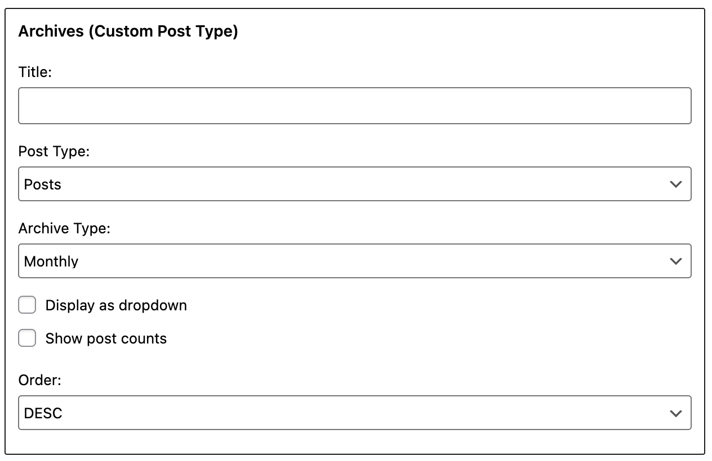
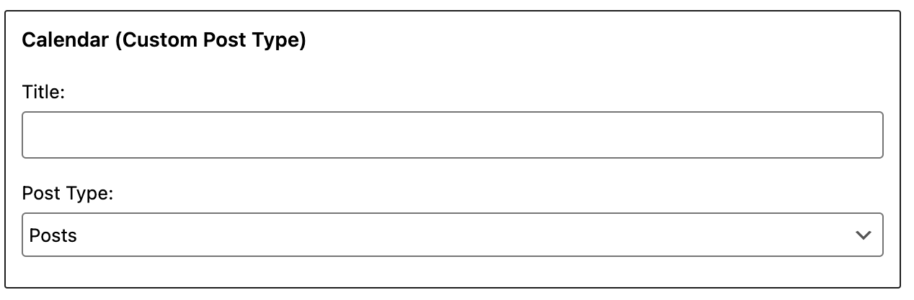
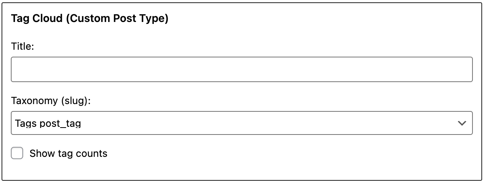
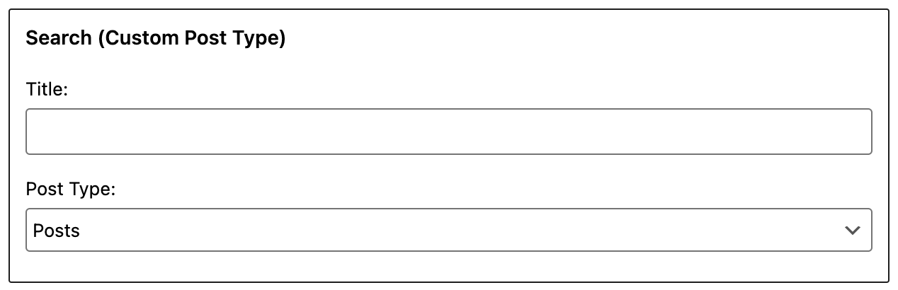

# Introducing Custom Post Type Widgets

This WordPress plugin adds default custom post type widgets. You can filter by registered Custom Post Type or Taxonomy on widgets.

## How do I use it?

1. Download and unzip files. Or install Custom Post Type Widgets plugin using the WordPress plugin installer. In that case, skip 2.
2. Upload "custom-post-type-widgets" to the "/wp-content/plugins/" directory.
3. Activate the plugin through the 'Plugins' menu in WordPress.
4. Adds widgets to a widget area and configure settings through the 'Widgets' menu in WordPress.
5. Have fun!

**IMPORTANT**: By default, WordPress will not work Date-based permalinks of custom post type. Recommend that you install the plugin in order to edit the permalink, if you are using a Date-based permalinks.

And try the following: [Custom Post Type Rewrite](https://wordpress.org/plugins/custom-post-type-rewrite/)

## Descriptions of Widgets

### Recent Posts (Custom Post Type)

display a list of the most recent custom posts.

* **Title** - description that appears over the list of recent custom posts.
* **Post Type** - if selected, filter by a custom post type. (e.g. post).
* **Number of posts to show (at most 15)** - enter the number of posts to display.
* **Display post date?** - if checked, display post date.
* **Class Name** - widget_recent_entries

### Archives (Custom Post Type)

display a list of archive links for each month that has custom posts.

* **Title** - description that appears over the list of archive links.
* **Post Type** - if selected, filter by a custom post type. (e.g. post).
* **Display as dropdown** - if checked, this box causes the archives to be displayed in a drop-down box.
* **Show post counts** - if checked, this box causes a count of the number of posts for each archive period.
* **Class Name** - widget_archive

### Categories (Custom Post Type)

display a list of categories that has custom posts.

* **Title** - description that appears over the list of categories.
* **Taxonomy** - if selected, filter a custom taxonomy (e.g. category).
* **Display as dropdown** - if checked, this box causes the categories to be displayed in a dropdown box.
* **Show post counts** - if checked, this box causes the count of the number of posts to display with each category.
* **Show hierarchy** - if checked, shows parent/child relationships in an indented manner.
* **Class Name** - widget_categories

### Calendar (Custom Post Type)

display a calendar of the current month.

* **Title** - description that appears over the calendar.
* **Post Type** - if selected, filter by a custom post type. (e.g. post).
* **Class Name** - widget_calendar

### Recent Comments (Custom Post Type)

display a list of the most recent comments.

* **Title** - description that appears over the list of recent comments.
* **Post Type** - if selected, filter by a custom post type. (e.g. post).
* **Number of comments to show (at most 15)** - enter the number of comments to be displayed.
* **Class Name** - widget_recent_comments

### Tag Cloud (Custom Post Type)

display a list of the top 45 that has used in a tag cloud.

* **Title** - description that appears over the tag cloud.
* **Taxonomy** - if selected, filter a custom taxonomy (e.g. post_tag).
* **Class Name** - widget_tag_cloud

### Search (Custom Post Type)

A search form for your site.

* **Title** - description that appears over the search.
* **Post Type** - if selected, filter by a custom post type. (e.g. post).
* **Class Name** - widget_search

## Contribute

Small patches, bug reports and the translation can be submitted a issue tracker in Github. Forking on Github is another good way. You can send a pull request.

Github : [custom-post-type-widgets](https://github.com/thingsym/custom-post-type-widgets)

If you would like to contribute, here are some notes and guidlines.

* All development happens on the **develop** branch, so it is always the most up-to-date
* The **master** branch only contains tagged releases
* If you are going to be submitting a pull request, please submit your pull request to the **develop** branch
* See about [forking](https://help.github.com/articles/fork-a-repo/) and [pull requests](https://help.github.com/articles/using-pull-requests/)

## Changelog

* Version 1.1.1
	* add apply_filters 'WP_Custom_Post_Type_Widgets_Search_filter_post_type' [Search widget]
	* improve function 'query_search_filter_only_post_type' [Search widget]
	* change to add_action 'pre_get_posts' run only on the front-end page [Search widget]
* Version 1.1.0
	* add 'All' to posttype option
	* refactoring
	* add Custom Post Type Search widget
* Version 1.0.4
	* fix cache key of Custom Post Type Calendar widget
	* support for custom post type slugs
	* add german translation
* Version 1.0.3
	* add italian translation
* Version 1.0.2
	* fix $cat_args['show_option_none']
* Version 1.0.1
	* fix the 'name' param of get_terms()
* Version 1.0.0
	* Initial release
